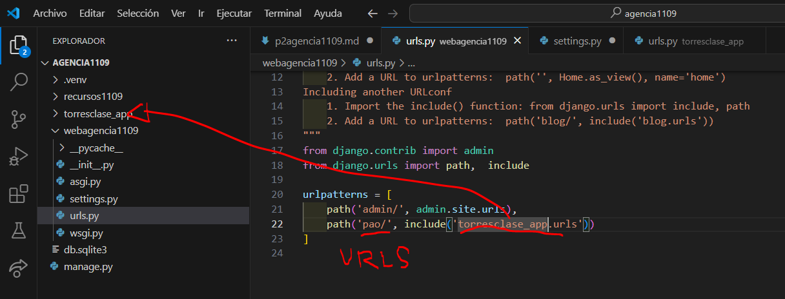

- Crear aplicacion torresclase_app
- comando --> python manage.py startapp torresclase_app
- creamos el archivo urls.py eb torresclase_app
- 
- En setting.py de webagencia1109
- 
- En urls.py de webagencia1109
- 
- en urls.py en torresclase_app
- 
- en views.py en torresclase_app
- 
- en urls en torresclase_app
- 